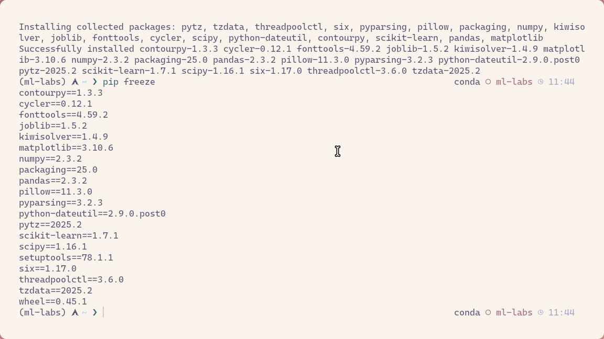
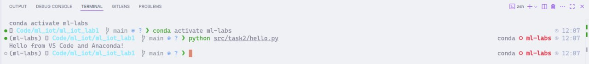
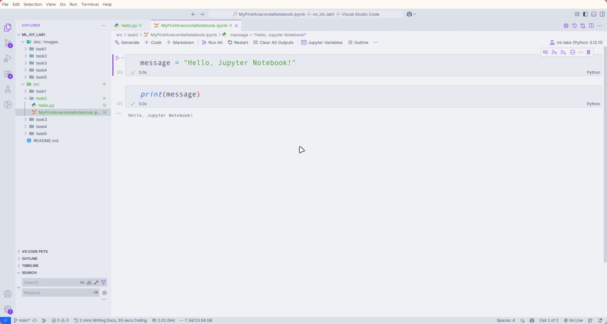
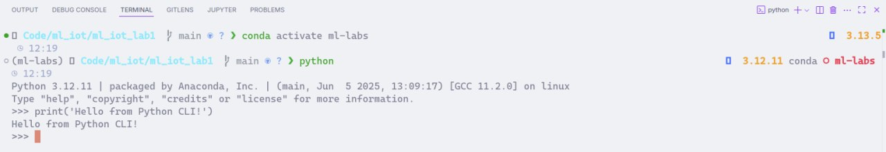
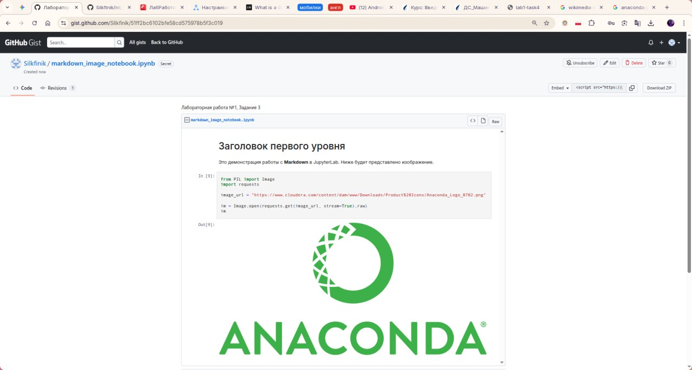

### **1. Цель работы**

Целью данной лабораторной работы являлось получение практических навыков по созданию, настройке и управлению виртуальными окружениями с помощью Anaconda для решения задач машинного обучения, а также знакомство с основными инструментами разработки, такими как Jupyter Notebook, JupyterLab и Google Colab.

---

### **2. Используемые утилиты, библиотеки и зависимости**

* **Язык программирования:** Python 3.12.11
* **Среда разработки:** Visual Studio Code 1.102.3
* **Менеджер пакетов и окружений:** Conda 25.5.1
* **Основные библиотеки:**
  * numpy==2.3.2
  * pandas==2.3.2
  * matplotlib==3.10.6
  * scikit-learn==1.7.1
  * jupyterlab==4.4.7
  * requests==2.32.5
  * pillow==11.3.0

---

### **3. Ход работы**

#### **Задание 1. Создание и настройка окружения Anaconda**

Была установлена Anaconda и настроена командная строка для ручной активации окружений. С помощью Anaconda Navigator было создано новое виртуальное окружение `ml-labs`, в которое были установлены все необходимые для курса библиотеки.

---

#### **Задание 2. Создание первого проекта на python в разных средах**

Для ознакомления с различными средами разработки были созданы и запущены проекты:

1. Скрипт `hello.py` в среде VS Code с использованием интерпретатора из окружения `ml-labs`.

2. Ноутбуки `MyFirstAnacondaNotebook.ipynb` и `MySecondAnacondaNotebook.ipynb` в VS Code с использованием расширения Jupyter.

3. Выполнена команда в интерактивной консоли Python.

---

#### **Задание 3. Знакомство с JupyterLab и публикация сниппетов кода на Github Gist**

В Jupyter-ноутбуке была продемонстрирована работа с ячейками Markdown и вставка изображений по URL с использованием библиотек `Pillow` и `requests`. Готовый ноутбук был опубликован как секретный Gist на GitHub.

* **Ссылка на Gist:** [https://gist.github.com/Silkfinik/51ff2bc6102bfe58cd575978b5f3c019](https://gist.github.com/Silkfinik/51ff2bc6102bfe58cd575978b5f3c019)

---

#### **Задание 4. Изучение возможностей консольных утилит curl и wget**

В Jupyter-ноутбуке была продемонстрирована возможность выполнения консольных команд с помощью префикса `!`. Были выполнены команды `wget` для скачивания файла с данными и `curl` для просмотра содержимого удаленного файла без сохранения.

---

#### **Задание 5. Изучение возможностей Google Colab**

Для знакомства с облачной платформой Google Colab был создан ноутбук, в котором были продемонстрированы следующие возможности:

* Загрузка `.csv` файла из публичного репозитория GitHub.
* Монтирование Google Диска и загрузка `.csv` файла с него.
* Вставка изображений.

* **Ссылка на Google Colab:** [https://colab.research.google.com/drive/13hWxc869HZTZbdrgr_PUKWjoXUflzvSn?usp=sharing](https://colab.research.google.com/drive/13hWxc869HZTZbdrgr_PUKWjoXUflzvSn?usp=sharing)

---

### **4. Выводы**

В ходе выполнения лабораторной работы были успешно освоены ключевые навыки для подготовки рабочего пространства к проектам в области машинного обучения. Было создано и настроено изолированное виртуальное окружение, изучены и опробованы на практике различные инструменты для разработки и анализа данных (VS Code, Jupyter, Google Colab), а также освоены базовые утилиты для работы с данными в сети.
